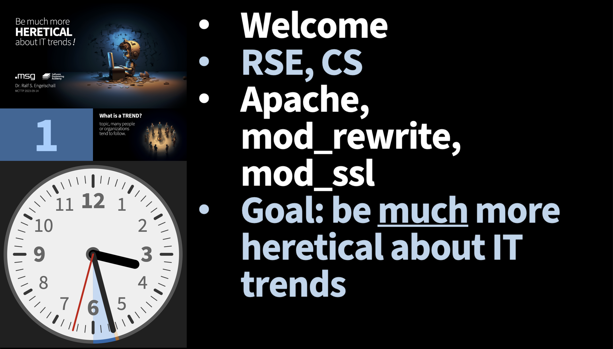
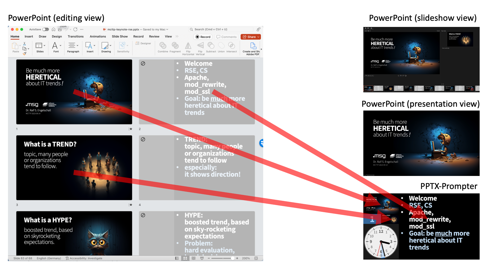

PPTX-Prompter
=============

**Prompter for PowerPoint**

 

About
-----

**PPTX-Prompter** is a client/server applications for showing a
prompter view for [Microsoft PowerPoint](https://www.microsoft.com/en/microsoft-365/powerpoint) &reg;
presentations (under Windows or macOS), based on
embedded, hidden, even numbered, pre-exported slides. It is intended as
a replacement (or companion) for the standard slideshow view of PowerPoint
and provides two killer features:

1. **Arbitrary Formatting**: It allows a *reasonable* text formatting of the prompter
   content, including arbitrary graphical elements. Whatever you can put onto
   a PowerPoint slide can be used as the individual prompter content.
   You are no longer constrained by the extremely limited text rendering
   possibilities of the standard slideshow view.

2. **Analog Clock**: It provides a nice *analog* clock, showing the done and remaining speaking time.
   The analog type of the clock is key, as it optically does not stress the speaker
   as much as a counting digital clock, does not require the speaker to perform any math
   calculations during his adrenalin spiced performance, and especially allows the speaker
   to get the current timing status with just a quick glance.

The application, written in [TypeScript](https://www.typescriptlang.org/), consists of
a central [Node.js](https://nodejs.org)-based server component and a HTML5
Single-Page Application (SPA) as the client component. The prompter view
can be opened in a fullscreen browser like [Google Chrome](https://www.google.com/chrome) or in
a browser source of [OBS Studio](https://obsproject.com). In the latter case, one usually also
projects the beamer content in realtime onto the left top corner of the prompter view with the
help of [NDI Tools](https://ndi.video/tools/) to get an even better user experience.

Overview
--------

The following is a screenshot of a prompter view corresponding to the
title slide of a keynote presentation: On the top left is the preview
of the current presentation content, below is the current (logical)
slide number and the preview of the next presentation content and at the
bottom left is an analog clock showing the done and remaining speaker
time. On the right is the prompter content.

Here is the corresponding setup overview: On the left is PowerPoint in
its editing view, where the odd numbered slides carry the presentation
content and the even numbered slides carry the prompter content.
On the right top is the PowerPoint slideshow control view (usually
visible on the notebook monitor), on the right middle is the PowerPoint
presentation view (usually visible on the beamer) and on the right
bottom is once again the prompter view (usually projected onto an
external monitor, staying in front of the keynote speaker).

Usage (Production)
------------------

- Under Windows/macOS install [Node.js](https://nodejs.org)
  for the server run-time, and [Google Chrome](https://www.google.com/chrome)
  for the client run-time.

- Run the prompter server component: 
  `npx pptx-prompter [...]`

- Open the prompter client in Google Chrome: 
  https://127.0.0.1:12345/

Usage (Development)
-------------------

- Under Windows/macOS install [Node.js](https://nodejs.org)
  for the server run-time and [Google Chrome](https://www.google.com/chrome)
  for the client run-time,
  plus [Visual Studio Code](https://code.visualstudio.com/) with its
  TypeScript, ESLint and VueJS extensions.

- Clone the source code: 
  `git clone https://github.com/rse/pptx-prompter`

- Install all dependencies: 
  `npm install`

- Run the development build-process once: 
  `npm start build-dev`

- Run the development build-process and prompter server component continuously: 
  `npm start dev`

- Open the prompter client in Google Chrome: 
  https://127.0.0.1:12345/

See Also
--------

- [TypeScript](https://www.typescriptlang.org/)
- [Vue.js](https://vuejs.org/)
- [Node.js](https://nodejs.org)
- [Slideshow](https://npmjs.com/slideshow)
- [PowerPoint](https://www.microsoft.com/en/microsoft-365/powerpoint)
- [OBS Studio](https://obsproject.com)
- [NDI Tools](https://ndi.video/tools/)

Copyright & License
-------------------

Copyright &copy; 2023 [Dr. Ralf S. Engelschall](mailto:rse@engelschall.com) 
Licensed under [GPL 3.0](https://spdx.org/licenses/GPL-3.0-only)

